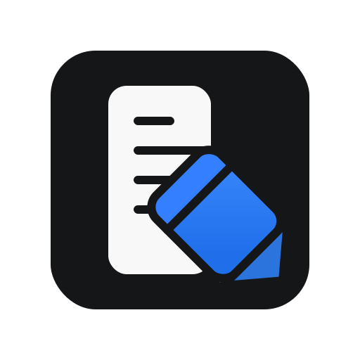

<p align="center">
  
</p>

# ACLogging

ACLogging is a small Swift Package for provider-agnostic application logging on iOS and macOS.

Documentation:
- Public documentation lives in [docs/](docs/README.md).
- Usage examples are available in the DocC articles under [Sources/ACLogging/ACLogging.docc](Sources/ACLogging/ACLogging.docc).
- Hosted docs are not published yet.
- Current public package release: not tagged yet; planned initial release is `0.1.0`.

## Why ACLogging

- Keep app logging provider-agnostic so analytics, diagnostics, and screen tracking do not leak vendor SDK types into feature code.
- Keep the core target dependency-free while adapters opt into platform or provider-specific behavior.
- Give tests a first-class `MockLogService` so event forwarding can be asserted without network calls or provider SDK setup.

The package is split into focused products:

- `ACLogging`: dependency-free core types, including `LogManager`, `LogService`, `LoggableEvent`, `LogParameters`, and `LogValue`.
- `ACLoggingOSLog`: Apple `OSLog` adapter for local development, Console, and unified logging.
- `ACLoggingSwiftUI`: SwiftUI screen lifecycle tracking helpers.
- `ACLoggingTestSupport`: testing utilities such as `MockLogService`.

Firebase and Mixpanel are intentionally separate future adapters. They should live outside the core so their SDK dependencies never leak into `ACLogging`.

## Platform and Tooling

- Swift tools: `6.0`
- Supported Apple platforms:
  - iOS `17+`
  - macOS `14+`

Notes:
- `ACLogging` and `ACLoggingTestSupport` are platform-neutral within the package platform floors.
- `ACLoggingOSLog` depends on Apple's unified logging APIs.
- `ACLoggingSwiftUI` depends on SwiftUI and is intended for SwiftUI view lifecycle tracking.

## Installation

### Xcode

1. Open `File > Add Package Dependencies...`
2. Use: `https://github.com/antoniocasto/ACLogging.git`
3. Pick a branch until the initial `0.1.0` release is tagged, then pick the release version.

### `Package.swift`

After the initial `0.1.0` release is tagged, add the package with Swift Package Manager:

```swift
dependencies: [
    .package(url: "https://github.com/antoniocasto/ACLogging.git", from: "0.1.0")
]
```

Then add the products you need to each target:

```swift
.target(
    name: "YourApp",
    dependencies: [
        .product(name: "ACLogging", package: "ACLogging"),
        .product(name: "ACLoggingOSLog", package: "ACLogging"),
        .product(name: "ACLoggingSwiftUI", package: "ACLogging")
    ]
)
```

Until the first public tag exists, use a branch requirement instead:

```swift
dependencies: [
    .package(url: "https://github.com/antoniocasto/ACLogging.git", branch: "main")
]
```

## Versioning

ACLogging uses Semantic Versioning for package releases. Documentation, changelog entries, Git tags, and GitHub releases use plain versions such as `0.1.0`, without a leading `v`.

See [Versioning and Releases](docs/Versioning.md) for the release flow, changelog rules, tag format, and future `ROADMAP.md` conventions.

## Quick Start

```swift
import ACLogging
import ACLoggingOSLog

let logManager = LogManager(
    services: [
        OSLogService(
            subsystem: "com.example.app",
            category: "App"
        )
    ]
)
```

`OSLogService` accepts an explicit subsystem and falls back to `Bundle.main.bundleIdentifier ?? "ACLogging"` when one is not provided. Event parameters are rendered with `.private` privacy by default.

## Typed Events

Model events as typed values and expose the `LoggableEvent` fields:

```swift
import ACLogging

enum PaywallEvent: LoggableEvent {
    case viewStart(source: String)
    case purchaseSuccess(productId: String, amount: Double)
    case purchaseFail(reason: String)

    var eventName: String {
        switch self {
        case .viewStart:
            return "Paywall_View_Start"
        case .purchaseSuccess:
            return "Paywall_Purchase_Success"
        case .purchaseFail:
            return "Paywall_Purchase_Fail"
        }
    }

    var parameters: LogParameters? {
        switch self {
        case let .viewStart(source):
            return ["source": .string(source)]
        case let .purchaseSuccess(productId, amount):
            return [
                "productId": .string(productId),
                "amount": .double(amount)
            ]
        case let .purchaseFail(reason):
            return ["reason": .string(reason)]
        }
    }

    var options: LogOptions {
        switch self {
        case .viewStart:
            return LogOptions(logType: .info)
        case .purchaseSuccess:
            return LogOptions(logType: .analytic)
        case .purchaseFail:
            return LogOptions(logType: .warning, parameterPrivacy: .hidden)
        }
    }
}
```

Track events through the manager:

```swift
logManager.trackEvent(PaywallEvent.viewStart(source: "home"))
logManager.trackEvent(
    eventName: "Settings_Save_Success",
    parameters: ["section": .string("notifications")],
    options: LogOptions(logType: .analytic, parameterPrivacy: .private)
)
```

The public API uses `LogParameters` and `LogValue`, not `[String: Any]`. This keeps adapter implementations deterministic and avoids runtime type casting.

## User Properties

```swift
logManager.identifyUser(
    userId: "user-123",
    name: "Antonio",
    email: "antonio@example.com"
)

logManager.addUserProperties(
    [
        "plan": .string("pro"),
        "isBetaTester": .bool(true)
    ],
    isHighPriority: true
)
```

## SwiftUI Screen Tracking

Import `ACLoggingSwiftUI`, inject a `LogManager`, and attach `screenLogging(name:)` to views:

```swift
import ACLogging
import ACLoggingSwiftUI
import SwiftUI

struct ContentView: View {
    let logManager: LogManager

    var body: some View {
        PaywallView()
            .logManager(logManager)
    }
}

struct PaywallView: View {
    var body: some View {
        Text("Paywall")
            .screenLogging(name: "Paywall")
    }
}
```

This tracks `Paywall_appear` on `onAppear` and `Paywall_disappear` on `onDisappear`. `LogManager` does not need to be `@Observable`.

## Current Limits

- ACLogging does not ship Firebase, Mixpanel, or network-backed adapters yet.
- `LogManager` forwards calls synchronously to configured services; queueing, retry, persistence, and batching are adapter responsibilities.
- `ACLoggingOSLog` is intended for local diagnostics and unified logging, not remote analytics delivery.
- `ACLoggingSwiftUI` logs `onAppear` and `onDisappear` lifecycle events only; navigation semantics remain owned by the consuming app.

## Catalog App

The repository includes a small iOS SwiftUI catalog app for evaluating ACLogging before importing it into another project.

Open:

```text
Examples/ACLoggingCatalog/ACLoggingCatalog.xcodeproj
```

Run the `ACLoggingCatalog` scheme on an iOS simulator. The catalog demonstrates:

- typed `LoggableEvent` scenarios
- convenience `trackEvent(eventName:parameters:options:)` calls
- user identity and property calls
- SwiftUI screen lifecycle logging
- in-app captured calls through a demo `LogService`
- OSLog formatting and future adapter slots for Firebase, Mixpanel, and custom providers

## Usage Articles

DocC includes focused usage articles for the main integration paths:

- [Typed event examples](Sources/ACLogging/ACLogging.docc/TypedEventExamples.md)
- [OSLog adapter examples](Sources/ACLogging/ACLogging.docc/OSLogAdapterExamples.md)
- [SwiftUI screen tracking examples](Sources/ACLogging/ACLogging.docc/SwiftUIScreenTrackingExamples.md)
- [Testing examples](Sources/ACLogging/ACLogging.docc/TestingExamples.md)

## Event Naming

Use this convention:

```text
<Feature>_<Action>_<State>
```

Examples:

- `Paywall_View_Start`
- `Paywall_View_Success`
- `Paywall_View_Fail`
- `Settings_Save_Success`
- `Onboarding_Skip`

For async flows, prefer `Start`, `Success`, and `Fail` states so dashboards can group complete flows. Business events such as `Paywall`, `Purchase`, `Onboarding`, and `Settings` should use the same convention.

## Tests

Use `MockLogService` from `ACLoggingTestSupport` to assert forwarded calls without hitting real providers:

```swift
import ACLogging
import ACLoggingTestSupport
import Testing

@Test("tracks paywall start")
func tracksPaywallStart() {
    let service = MockLogService()
    let manager = LogManager(services: [service])

    manager.trackEvent(PaywallEvent.viewStart(source: "home"))

    #expect(service.trackEventCalls.count == 1)
    #expect(service.trackEventCalls.first?.event.eventName == "Paywall_View_Start")
}
```

## Development

```bash
swift package resolve
swift build
swift test
```

DocC validation is performed by the GitHub Actions workflows. Locally, use Xcode's package documentation build when an Apple toolchain with DocC support is selected.

## Credits

This package was built while following the SwiftUI Advanced Architectures course by Nick Sarno.

YouTube: @SwiftfulThinking
Course: SwiftUI Advanced Architectures

## License

MIT. See [LICENSE.md](LICENSE.md).
